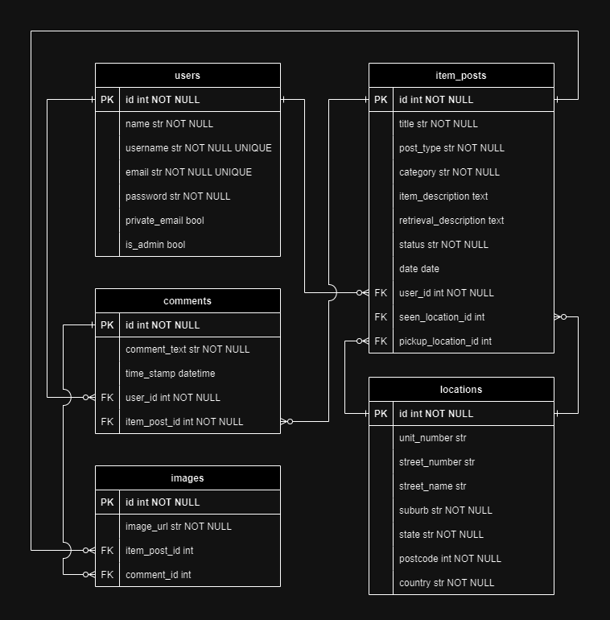

# T2A2 API Web Server Project

## Student: Deandre Sugandhi

[Github Repository](https://github.com/deandresugandhi/DeandreSugandhi_T2A2)

## Table of Contents

- [R1](#r1---identification-of-the-problem-you-are-trying-to-solve-by-building-this-particular-app)
- [R2](#r2---why-is-it-a-problem-that-needs-solving)
- [R3](#r3---why-have-you-chosen-this-database-system-what-are-the-drawbacks-compared-to-others)
- [R4](#r4---identify-and-discuss-the-key-functionalities-and-benefits-of-an-orm)
- [R5](#r5---document-all-endpoints-for-your-api)
- [R6](#r6---an-erd-for-your-app)
- [R7](#r7---detail-any-third-party-services-that-your-app-will-use)
- [R8](#r8---describe-your-projects-models-in-terms-of-the-relationships-they-have-with-each-other)
- [R9](#r9---discuss-the-database-relations-to-be-implemented-in-your-application)
- [R10](#r10---describe-the-way-tasks-are-allocated-and-tracked-in-your-project)
- [Reference List](#reference-list)

## R1 - Identification of the problem you are trying to solve by building this particular app

The purpose of this app is to assist people trying to find and retrieve items they have lost, especially in establishments where this may occur more often, such as train stations, buses, printing stations / internet cafes (leaving USBs / other portable storage devices in the computers), supermarkets, and cinemas, as well as in 'unowned' spaces which may not have a dedicated lost-and-found facility, such as public roads, highways, sidewalks, bus stops, public toilets, some recreation areas, public markets, and open plazas.

This app will be designed so that it can be used flexibly as a solution to various problems. For example, it can be used as a tool for establishments to improve their own lost-and-found facilities, or maybe developed into an independent community website for items lost in unowned public spaces.

## R2 - Why is it a problem that needs solving?

While many places usually have dedicated lost-and-found facilities, where staffs keep reliable records of lost items and store them safely for people to retrieve later, based on my experience, people will usually need to contact these establishments through phone or email to find out if the items they have lost are there. This may be inefficient for both parties at times; for example, busy establishments and their staffs may take longer to respond to such emails, or to pick up such calls, only for the callers to possibly discover that their items are not there or that they may have misplaced their items elsewhere.

Furthermore, while dealing with people claiming their lost items may require more personal verification methods such phone calls or face-to-face meetings, dealing with people just trying to find out if their lost items are kept in an establishment's lost-and-found section does not necessarily require such measures; thus it can be argued that records of such items should be made more accessible, such as by displaying them in websites. This app can potentially eliminate unnecessary work for staffs who need to respond to inquiries on lost items which may not even be left there, as well as making it more convenient for people to trace their lost items.

Another problem this app can address is for items that are lost in 'unowned' spaces such as public roads, highways, sidewalks, bus stops, public toilets, some recreation areas, public markets, open plazas, etc., which may not have dedicated lost-and-found facilities. A person finding someone else's misplaced items in such places, especially items without some sort of identification, may not be sure what to do with them. For example, moving them to a safer, more hidden location can possibly cause more confusion for the owner of the items if they immediately retrace their steps and come back for it. Turning it in to a nearby establishment / local authorities can be similarly confusing for both parties especially if there are multiple establishments / authorities nearby. On the other hand, leaving them where they are leaves them vulnerable to thieves. This app can make it easier for these people to make a decision; they can make a post in the web app, noting which establishment they have turned these items to, or even their own contact information if they decide to hold the items temporarily for safekeeping.

## R3 - Why have you chosen this database system? What are the drawbacks compared to others?

I have chosen to use PostgreSQL as the database management system for this app.

One reason for this decision is its robustness. PostgreSQL is an ACID-compliant (Atomicity, Consistency, Isolation, Durability) DBMS, ensuring all database transactions are processed in a reliable way that prioritizes data integrity (Singh, 2023). Some of its built-in data integrity mechanisms include data types, triggers, and constraints. Furthermore, its write-ahead logging, according to Peterson (2023), minimizes the possibility of data loss. Data integrity is particularly important for systems like a lost-and-found system, whose main purpose is to accurately manage and record data on the lost items in order to minimize the difficulties of reporting, finding, and retrieving them. PostgreSQL's features such as constraints also ensure that items are categorized and named accordingly, making search functionalities more reliable for people trying to locate their lost items.

Another reason for choosing PostgreSQL is its performance and scalability. It supports various performance optimization such as unrestricted concurrency and geospatial support, making it efficient as the lost-and-found database grows (IBM, n.d.). Its support for geospatial data types with its powerful extensions may also prove to be useful as the app is developed further, as a lost-and-found system would benefit greatly from having detailed geographical information on the items (such as where they are found and where they are currently located) that are managed efficiently. Furthermore, PostgreSQL is a mature and widely adopted DBMS; it existed since the 1990s and have been developed ever since as an open-source software with a large and active community, becoming one of the most popular DBMS (Bollhoff, 2023; Panchenko, 2021).

PostgreSQL can also be relatively easy to operate. According to Davidson (2022) and Dhruv (2023), with its features such as transactional Data Definition Language (DDL), users can perform multiple functions in a single transaction (such as dropping and creating tables), something especially helpful when managing complex relational applications, especially as the lost-and-found database grows.

However, according to Kolovson (2021), PostgreSQL can contain too many 'moving parts' due to its extensibility, meaning that it can quickly be complicated to set up and maintain over time. Implementing PostgreSQL in, for example, embedded applications like virtual machines or containers, can thus be inconvenient (Kolovson, 2021). The fact that PostgreSQL is open-source, while not without its unique benefits, also meant that it requires user to research multiple choices of solutions or vendors when choosing what functionality to include in the system, something which requires some form of knowledge, expertise and effort in the users' end (Panchenko, 2021).

For reference, PostgreSQL can be compared with other popular DBMS, such as MySQL.

### PostgreSQL drawbacks vs MySQL

- While PostgreSQL is a widely used DBMS, it is still arguably less popular than MySQL, meaning that MySQL has more third party tools to choose from (Hristozov, 2019).

- PostgreSQL, compared to MySQL, may need more memory allocation due to it forking new processes for each new client connection, while MySQL maintain a single thread for its connections (Hristozov, 2019; Ravoof, 2023).

- Since PostgreSQL is built for extensibility, compliance, data integrity, and scalability, sometimes performance and speed can be sacrificed, meaning that in simple, read-heavy workflows, MySQL can perform faster and better in general (Hristozov, 2019).

- MySQL is more compatible in terms of being cross-platform, while PostgreSQL is built to be more optimal when used on UNIX-based systems (Smallcombe, 2023).

- MySQL has light-weight versions available to support less complex use case, while PostgreSQL's light-weight versions are less commonly used (Smallcombe, 2023).

### MySQL drawbacks vs PostgreSQL

- MySQL is a purely relational database, while PostgreSQL is an object-relational database, meaning that PostgreSQL support wider and more complex data types, as well as having features such as function overloading or table inheritance that can be crucial in certain use cases (Hristozov, 2019).

- PostgreSQL supports a wider range of programming languages compared to MySQL (Ravoof, 2023).

- In MySQL, replications is one-way asynchronous, meaning that there is one database server that acts as the primary and the other one being replicas; on the other hand, PostgreSQL supports synchronous replication, where two databases run simultaneously, allowing users to perform synchronous and cascading replication (Ravoof, 2023).

- PostgreSQL is more SQL compliant compared to MySQL, supporting more features such as no check constraints and other primary SQL features (Ravoof, 2023).

## R4 - Identify and discuss the key functionalities and benefits of an ORM

ORM (Object Relational Mapping) is a technique or layer that bridges object-oriented programs (OOP) and relational databases (Abba, 2022). By design, SQL is used to perform operations such as creating, reading, and deleting (CRUD) data from databases; with an ORM tool, developers can instead use OOP languages such as Python, Java, and PHP to generate SQL queries that perform these operations, simplifying the code and process as developers would not need to manually write complex SQL queries (Abba, 2022).

### Key Functionalities

- ORM tools functions by first mapping objects in the programming language and the tables in the database, which is done by the developers describing the mapping between the object's fields and the columns in the database tables in the programming language the app is written in (Kanade, 2023). Based on these mappings, database records can be worked with as objects, and developers can use object-oriented programming to interact with the database as well as use the ORM tool's other features.

- ORM can use multiple strategies to map the tables and objects, such as active record (defines the structure in which each table is paired to a class, and each class instance mapped to the table's records), data mapper (separates the objects, i.e. the models, from the database layer), table gateway (structures the app in a way that each database table has a separate gateway from which the models communicate with to access them), identity map (minimizes database queries by ensuring each instance represents each object in the app), and unit of work (manage database transactions, by defining which set of operations should be grouped as a single transaction) (Kanade, 2023).

- ORM allows developers to perform CRUD (Create, Read, Update, Delete) operations on the database using object-oriented programming (Abba, 2022).

- ORM provides a high-level query language, which is later translated to generate SQL queries, that allows developers to use object-oriented models, which is also usually more expressive and abstract compared to raw SQL (Abba, 2022). This also means that since the app code is agnostic to the database system used, it can be reused in different database systems (Kanade, 2023).

- ORM tools often provide functionalities for data validation, such as different forms of constraints and field types that can be defined in the object models.

- ORM allows developers to map relationships between tables in a relational database, such as one-to-one relationships, one-to-many relationships, etc.

- ORM tools can have functionalities for performance optimization, such as caching, lazy loading, and auto generating the most efficient SQL queries (Kanade, 2023).

- ORM systems have functionalities to manage transaction, ensuring that changes are made atomically; either all the changes are made or not at all for data consistency (Kanade, 2023).

- ORM systems have functionalities to handle database schema changes, such as auto-generation of database schema changes based on changes made to object mappings (Kanade, 2023).

### Benefits

- Interacting with databases becomes simpler as ORM handles the logic required to perform the appropriate SQL queries (Abba, 2022).

- Simpler interaction with databases also means that developers can shift their focus on other tasks such as application development and business logic, translating to higher productivity and faster development cycles (Kanade, 2023).

- Improves security, as ORM tools are designed to prevent SQL injection attacks (Abba, 2022).

- Code and database maintenance can be easier with ORM tools, as they usually have dedicated tools to manage database changes, automatically updating schemas based on any changes to the mappings, as well as tools to track, backup, and restore records in the database, an appropriate failsafe measure (Kanade, 2023).

- Performing operations, such as CRUD operations, require less code with ORM tools (Abba, 2022).

- By separating the application logic from the database, ORM tools can help promote code modularity and reusability, allowing developers to reuse existing codes for different database systems (Kanade, 2023)

- ORM tools can help improve performance, as it can reduce the quantity of database calls used to retrieve data, such as through the use of lazy loading, caching, and automatically generating the most efficient SQL queries based on the specific database and conditions (Kanade, 2023).

## R5 - Document all endpoints for your API

### 1. /item-posts/

__HTTP Request__: GET

__Required Data__: None

__Expected Response Data__: Expected return of JSON response with data on all item posts on the database, with a '200 OK' status code response

__Authentication methods__: None

__Purpose__: Allows registered and unregistered users to view all item posts on the database

### 2. /item-posts/&lt;field&gt;/&lt;keyword&gt;

__HTTP Request__: GET

__Required Data__: None

__Expected Response Data__: Expected return of JSON response with data on multiple item posts from the database, based on __field__ and __keyword__ parameters, with a '200 OK' status code response

__Authentication methods__: None

__Purpose__: Allows registered and unregistered users to search for item posts on the database by inputting __field__ parameter (representing the column on the item posts table) and __keyword__ parameter (representing the keyword to search for) in the URL

### 3. /item-posts/&lt;id&gt;

__HTTP Request__: GET

__Required Data__: None

__Expected Response Data__: Expected return of JSON response with data on a specific item post from the database based on the __id__ parameter, with a '200 OK' status code response

__Authentication methods__: None

__Purpose__: Allows registered and unregistered users to view an item post of a specific id by inputting its __id__ in the __id__ parameter in the URL.

### 4. /item-posts/

__HTTP Request__: POST

__Required Data__:

REQUIRED: title, post_type, category, status

OPTIONAL (None / default value is set if unspecified): item_description, retrieval_description, seen_location (dictionary based on LocationSchema), pickup_location (dictionary based on LocationSchema), images (list of dictionaries based on ImageSchema)

__Expected Response Data__: Expected return of JSON response with data on the newly created item post, with a '201 Created' status code response

__Authentication methods__: Valid JWT token

__Purpose__: Allows registered users to create an item post which will be associated with their user account.

### 5. /item-posts/&lt;id&gt;

__HTTP Request__: PUT, PATCH

__Required Data__:

REQUIRED: title, post_type, category, status

OPTIONAL (None / default value is set if unspecified): item_description, retrieval_description, seen_location (based on LocationSchema), pickup_location (based on LocationSchema), images (based on ImageSchema)

__Expected Response Data__: Expected return of JSON response with data on the newly edited / updated item post, with a '201 Created' status code response

__Authentication methods__: Valid JWT token, authorize(item_post.user_id) which ensures the item post edited is associated with either the same user id retrieved from get_jwt_identity() or a user with admin rights

__Purpose__: Allows registered user (or admin) to edit some details on their own associated item post

### 6. /item-posts/&lt;id&gt;

__HTTP Request__: DELETE

__Required Data__: None

__Expected Response Data__: Expected return of JSON response with data on the newly deleted item post, with a '200 OK' status code response

__Authentication methods__: Valid JWT token, authorize(item_post.user_id) which ensures the item post deleted is associated with either the same user id retrieved from get_jwt_identity() or a user with admin rights

__Purpose__: Allows registered user (or admin) to delete an item post associated with their user account

### 7. /item-posts/&lt;item_post_id&gt;/comments/

__HTTP Request__: GET

__Required Data__: None

__Expected Response Data__: Expected return of JSON response with data on all comments on a specific item post from the database based on the __item_post_id__ parameter, with a '200 OK' status code response

__Authentication methods__: None

__Purpose__: Allows registered and unregistered users to view the comments in an item post of a specific id by inputting its __id__ as the __item_post_id__ parameter in the URL

### 8. /item-posts/&lt;item_post_id&gt;/comments/

__HTTP Request__: POST

__Required Data__:

REQUIRED: comment_text

OPTIONAL (None / default value is set if unspecified): images (list of dictionaries based on ImageSchema)

__Expected Response Data__: Expected return of JSON response with data on the newly created comment (associated with the item post with __id__ same as that inputted as the __item_post_id__ parameter), with a '201 Created' status code response

__Authentication methods__: Valid JWT token

__Purpose__: Allows registered users to create a comment in an item post of a specific id by inputting its __id__ as the __item_post_id__ parameter in the URL

### 9. /item-posts/&lt;item_post_id&gt;/comments/&lt;comment_id&gt;

__HTTP Request__: PUT, PATCH

__Required Data__:

REQUIRED: comment_text

OPTIONAL (None / default value is set if unspecified): images (list of dictionaries based on ImageSchema)

__Expected Response Data__: Expected return of JSON response with data on the newly edited / updated comment (associated with the item post with __id__ same as that inputted as the __item_post_id__ parameter), with a '201 Created' status code response

__Authentication methods__: 

__Purpose__:

### 10. /item-posts/&lt;item_post_id&gt;/comments/&lt;comment_id&gt;

__HTTP Request__: DELETE

__Required Data__:

__Expected Response Data__:

__Authentication methods__:

__Purpose__:

### 11. /item-posts/locations/&lt;seen_or_pickup&gt;/&lt;field&gt;/&lt;keyword&gt;

__HTTP Request__: GET

__Required Data__:

__Expected Response Data__:

__Authentication methods__:

__Purpose__:

### 12. /users/register

__HTTP Request__: POST

__Required Data__:

__Expected Response Data__:

__Authentication methods__:

__Purpose__:

### 13. /users/login

__HTTP Request__: POST

__Required Data__:

__Expected Response Data__:

__Authentication methods__:

__Purpose__:

### 14. /users/

__HTTP Request__: GET

__Required Data__:

__Expected Response Data__:

__Authentication methods__:

__Purpose__:

### 15. /users/&lt;id&gt;

__HTTP Request__: GET

__Required Data__:

__Expected Response Data__:

__Authentication methods__:

__Purpose__:

### 16. /users/&lt;id&gt;

__HTTP Request__: PUT, PATCH

__Required Data__:

__Expected Response Data__:

__Authentication methods__:

__Purpose__:

### 17. /users/&lt;user_id&gt;

__HTTP Request__: DELETE

__Required Data__:

__Expected Response Data__:

__Authentication methods__:

__Purpose__:

## R6 - An ERD for your app

## R7 - Detail any third party services that your app will use

### Flask

Flask is a python web framework used to create web applications. It is used to create the URL routes with its specific functions as well as handling different HTTP requests. As a microframework, it is simple, scalable, and supports extension to add more capabilities to the application (Pallets, 2010).

### SQL Alchemy (Flask-SQLAlchemy)

SQL Alchemy is used as the app's Python SQL toolkit and ORM (Object Relational Mapper) that allows the use of python code to perform SQL queries (Bayer & SQLAlchemy Contributors, n.d.). It also allows the usage of Python's object-oriented programming features with SQL databases, such as using model classes to represent tables and their respective records, making the process more convenient and easier to visualize.

### Marshmallow (Flask-Marshmallow)

Marshmallow is an ORM, ODM, or framework-agnostic library to convert complex data types to and from native Python data types (Loria & Contributors, 2023). Flask-Marshmallow is the Flask extension that allows using Marshmallow functionalities in Flask. It allows the creation of schemas, serializing / deserializing data format like JSON from HTTP requests into Python data format and vice versa, allowing these information to be processed easily by Python. Marshmallow's built-in functionality, such as data validation and nesting, also offers a more robust way to execute operations that would otherwise be more complex to perform, also making error handling to be neater and more streamlined.

### Psycopg2

Psycopg2 is a PostgreSQL database adapter for Python, necessary to manage PostgreSQL databases using the Python programming language, connecting the Flask app with the database (Gregorio, Varrazzo & The Psycopg Team, 2021).

### Bcrypt (Flask-Bcrypt)

Bcrypt is used to hash passwords as a one-way encryption method to ensure passwords are securely stored. Flask-Bcrypt is a Flask extension that provides bcrypt hashing functionalities for Flask apps (Countryman, 2011).

### JWT Manager (Flask-JWT-Extended)

JWT Manager is used to manage JSON web tokens, used for secure user authentication for the app, and verifying user identity to allow them to use specific functionalities that are exclusive to certain users. Flask-JWT-Extended is a Flask extension that allows the using functionalities of JWT Manager in Flask apps, such as creating access token, protect routes, get identity of JWT tokens, etc. (Gilbert, 2016).

## R8 - Describe your projects models in terms of the relationships they have with each other

### User model

The User model represents a user record in the database. It has one-to-many relationships with the ItemPost and Comment models, meaning that a user can be associated with multiple item posts and comments as their owner, but each item post and comment stored in the database can only have one user as its original owner. To define this relationship, user_id is used as a foreign key in the ItemPost and Comment models. The cascade deletes ensure that all comments and item posts owned by a user is also removed from the database when that user is deleted.

### Location model

The Location model represents an address used in the app. It has one-to-many relationships with the ItemPost model, meaning that each location can be associated with multiple item posts, while each item post can only refer to one location record. In this case, however, each item post is linked to up to two location records, as an item post has two attributes linked to the Location model defined by the foreign keys in the __ItemPost__ model named __seen_location_id__ and __pickup_location_id__, both referring to the __location_id__ primary key of the __Location__ model. Further details will be explained in the __ItemPost__ model section.

### ItemPost model

The ItemPost model represents an item post record in the database. It has multiple relationships with multiple models. Firstly, it has a many-to-one relationship with the User model, meaning that a user can own multiple item posts but an item post can only have one user associated with it as its owner. This relationship is defined by using user_id as a foreign key in the ItemPost model.

Secondly, it has a one-to-many relationship with the Comment and Image model, since an item post can have multiple comments / images posted to it, while each comment / image can only be associated with one item post. This relationship is defined by using item_post_id as a foreign key in both the Comment and Image model. The cascade deletes ensure that the comments and images associated with an item post are also removed from the database when that item post is deleted.

Thirdly, it has a many-to-one relationship with the Location model. There are two attributes in the ItemPost model that refers to records in the Location model, namely seen_location_id (refers to the location in which the item was found or lost) and pickup_location_id (refers to the location in which the item can / requested to be picked up). These two are foreign keys in the ItemPost model referring to location_id in the Location model, defining this relationship. Each item post can only have one seen location and pickup location, while each location can be associated with multiple item posts.

### Comment model

The Comment model represents a comment posted on an item post. It has many-to-one relationships with the ItemPost and User models. A user can create multiple comments across multiple item posts, while each comment can only be owned by one user. Similarly, an item post can contain multiple comments posted into it, but a comment can only be associated with one item post, i.e. the item post in which it was posted. The relationship is defined through the inclusion of user_id (primary key of the User model) and item_post_id (primary key of the ItemPost model) as foreign keys in the Comment model.

It also has a one-to-many relationship with the Image model, as users can attach multiple images into their comments, with each image record stored in the database associated with only one comment / item_post. This relationship is defined by the comment_id foreign key (referring to the primary key of the Comment model) in the Image model.

### Image model

The Image model represents an image that is attached to either an item post or comment. It forms many-to-one relationships with the ItemPost and Comment models, as a user can attach multiple images into their item posts / comments, while each image can only be associated with one item post / comment. These relationships are defined by using comment_id (primary key of the Comment model) and item_post_id (primary key of the ItemPost model) as foreign keys in the Image model. A constraint is defined using SQLAlchemy's CheckConstraint class with XOR operator to specify that an image can only be associated with one of either an item post or comment, but not both.

## R9 - Discuss the database relations to be implemented in your application

For the purpose of this application, a PostgreSQL database named "lost_and_found_db" is created. To implement the relations and their relationships with one another, 5 tables are created in the database, namely users, item_posts, comments, images, and locations. The interaction between the records in these 5 relations will determine the main functionalities and behavior of the app.

### Users

User-related information are stored in the __users__ table. Each record in the table represents a registered user in the application, with information on their name, username, email, hashed password, admin rights, and their unique ID (the primary key).

### Item Posts

Item posts-related information are stored in the __item_posts__ table. Each record in the table represents an item post that have been posted into the system, with information on its title, post type (whether the user "found" or "lost" the item in the post), item category, item description, retrieval description (brief on how the item can be claimed, such as contact details or locations), item status (such as "claimed" or "unclaimed"), the date in which the post is created, the user who made the post (using a __user_id__ foreign key), seen location (the location in which the item is lost or found, using a __seen_location_id__ foreign key referring to a __location__ record), pickup location (the location in which the item can be claimed, using a __pickup_location_id__ foreign key referring to a __location__ record), and its unique ID (the primary key). As a result, a __user__ can be associated with multiple __item posts__, and an __item_post__ can be associated with up to two __location__ records.

### Comments

Comment-related information are stored in the __comments__ table. Each record in the table represents a comment that has been posted into an __item post__ in the system, with information on its text content, timestamp, the user who created the comment (using a __user_id__ foreign key referring to a __user__ record), and the __item post__ associated with the comment (using a __item_id__ foreign key referring to a an __item_post__ record). As a result, a __comment__ record is associated with one __item_post__ and __user__ record, with an __item_post__ and __user__ associated with multiple __comments__.

### Images

Image-related information are stored in the __images__ table. Each record in the table represents an image that has been attached to either an __item_post__ or __comment__ in the system, with information on its URL, its associated __item_post__ (using a __item_post_id__ foreign key referring an __item_post__ record), and its associated __comment__ (using a __comment__ foreign key referring a __comment__ record). There is a constraint added to the table to ensure that each image is associated with only one of either an __item_post__ or __comment__, but not both.

### Location

Location-related information are stored in the __location__ table. Each record in the table represents a location / address that has been registered with an __item_post__ record, containing information on its street number, street name, suburb, postcode, and country. Originally, a __postcodes__ table was planned to be created, as a postcode usually determines the state and suburb, which can thus be used as a primary key as they are unique. However, upon further research, this is cancelled because it seems that the relationship between postcodes, suburb, and state is more complicated than originally thought, as in rare cases a suburb can span multiple postcodes, and multiple states can have suburbs with the same name.

## R10 - Describe the way tasks are allocated and tracked in your project

### [GitHub Projects link](https://github.com/users/deandresugandhi/projects/4)

For this project, tasks were allocated and tracked using GitHub Projects. Tasks are categorized into cards, based on their dependencies (tasks that need to be completed before the other one can commence) and their connection to each other. Each card would thus contain checkboxes of tasks that I would tick as I complete then. These cards would then be put into three columns, namely __To Do__, __Doing__, and __Completed__. These are updated as I work on each tasks. New cards and tasks are also added each day as I add features to the app or add tasks that I haven't thought of before.

I added custom labels to further specify the importance of each card, using labels I have created before for previous projects, such as the __core__ label for cards that is integral for the functionality of the rest of the app, __enhancement__ label for cards that are optional additions to the app, etc.

The __Roadmap__ and __Table__ views are used to add due dates and keep track of schedules. These are updated as tasks are completed, with due dates being rather flexible to ensure that I can flexible work on tasks that may need more or less time to complete, factors which may not be accurately predicted at the start of the project.

Git is used to keep track of the versions, with frequent meaningful git commits to track my progress and reviewing my process. Version control helps in tracking the efficiency of the project, which is beneficial to improve my performance on both this current project and any future projects I may take part in.

The standup section of Coder Academy's discord channel is also helpful to track my progress and compare it with other students' progress, reflecting whether or not I am relatively behind or ahead throughout the project. However, I feel like I did not check and update enough in this section, which is something I aim to improve in the future. Similarly, I find that I wasn't sufficiently organized in my tasks allocation for this project. For example, I started coding in a haste before I made sure my planning is solid; as a result, my coding phase was rather messy, using a lot of time to debug and thinking about how to make my code run well, which I definitely could've avoided if I had completed the planning before starting to code. I also create the GitHub Project quite late into the project, which kind of defeats the purpose of task allocation. I still find it helpful in completing my project, although it could've been more useful if I had created it earlier, making the evolution of my project more streamlined.

## Reference List

Abba, I. V. (2022). _What is an ORM: the meaning of object relational mapping database tools_. FreeCodeCamp. https://www.freecodecamp.org/news/what-is-an-orm-the-meaning-of-object-relational-mapping-database-tools/

Bayer, M., & SQLAlchemy Contributors. (n.d.). _SQL Alchemy: the Python SQL toolkit and object relational mapper_. https://www.sqlalchemy.org/

Bollhoff, P. (2023). _PostgreSQL vs MySQL: a comparison of database technologies_. K&C. https://kruschecompany.com/postgresql-vs-mysql/

Countryman, M. (2011). _Flask-Bcrypt_. https://flask-bcrypt.readthedocs.io/en/1.0.1/#

Davidson, T. (2022). _Why use PostgreSQL for your next project?_. CleanCommit. https://cleancommit.io/blog/why-use-postgresql-for-your-next-project/

Dhruv, S. (2023). _PostgreSQL advantages and disadvantages_. https://www.aalpha.net/blog/pros-and-cons-of-using-postgresql-for-application-development/

Gilbert, L. A. (2016). _Flask-JWT-Extended's documentation_. https://flask-jwt-extended.readthedocs.io/en/stable/

Gregorio, F. D., Varrazzo, D., & The Psycopg Team. (2021). _Psycopg - PostgreSQL database adapter for Python_. https://www.psycopg.org/docs/

Hristozov, K. (2019). _MySQL vs PostgreSQL: choose the right database for your project_. Okta. https://developer.okta.com/blog/2019/07/19/mysql-vs-postgres

IBM. (n.d.). _What is PostgreSQL?_. IBM. https://www.ibm.com/topics/postgresql

Kanade, V. (2023). _What is ORM? A comprehensive guide to object-relational mapping_. Spiceworks. https://www.spiceworks.com/tech/data-management/articles/what-is-orm-a-comprehensive-guide-to-object-relational-mapping/

Kolovson, C. (2021). _Weighing the pros and cons of PostgreSQL_. https://medium.com/@ckolovson/weighing-the-pros-and-cons-of-postgresql-5a3603dd34ce

Loria, S., & Contributors. (2023). _Marshmallow: simplified object serialization_. Marshmallow. https://marshmallow.readthedocs.io/en/stable/

Pallets. (2010). _Flask_. https://flask.palletsprojects.com/en/3.0.x/

Panchenko, I. (2021). _PostgreSQL benefits and challenges: a snapshop_. InfoWorld. https://www.infoworld.com/article/3619531/postgresql-benefits-and-challenges-a-snapshot.html

Ravoof, S. (2023). _PostgreSQL vs MySQL: explore their 12 critical differences_. Kinsta. https://kinsta.com/blog/postgresql-vs-mysql/

Peterson, R. (2023). _What is PostgreSQL? Introduction, advantages & disadvantages_. Guru99. https://www.guru99.com/introduction-postgresql.html

Singh, G. (2023). _The power of PostgreSQL: a comprehensive exploration_. Vertisystem. https://vertisystem.medium.com/the-power-of-postgresql-a-comprehensive-exploration-dba09e0e030c

Smallcombe, M. (2023). _PostgreSQL vs MySQL: the critical differences_. Integrate.io. https://www.integrate.io/blog/postgresql-vs-mysql-which-one-is-better-for-your-use-case/